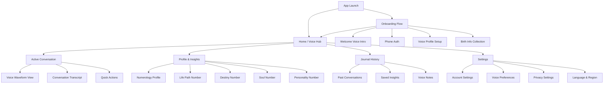
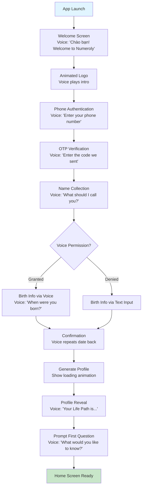
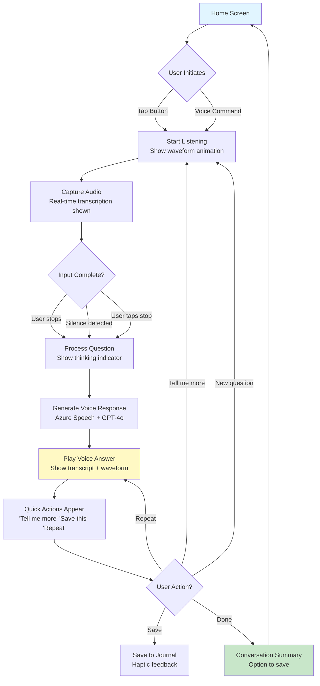
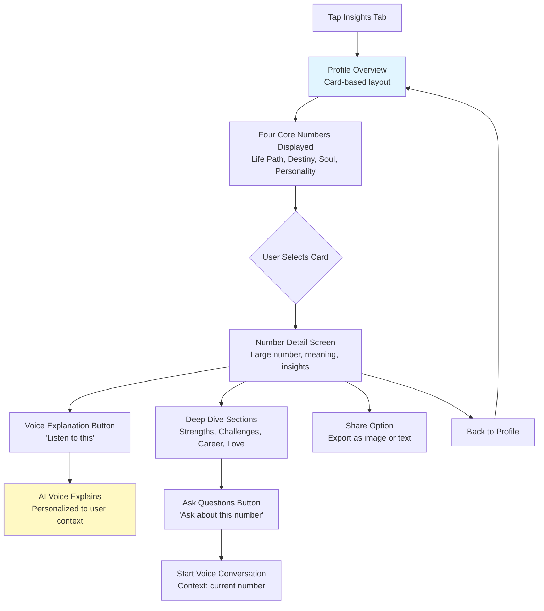
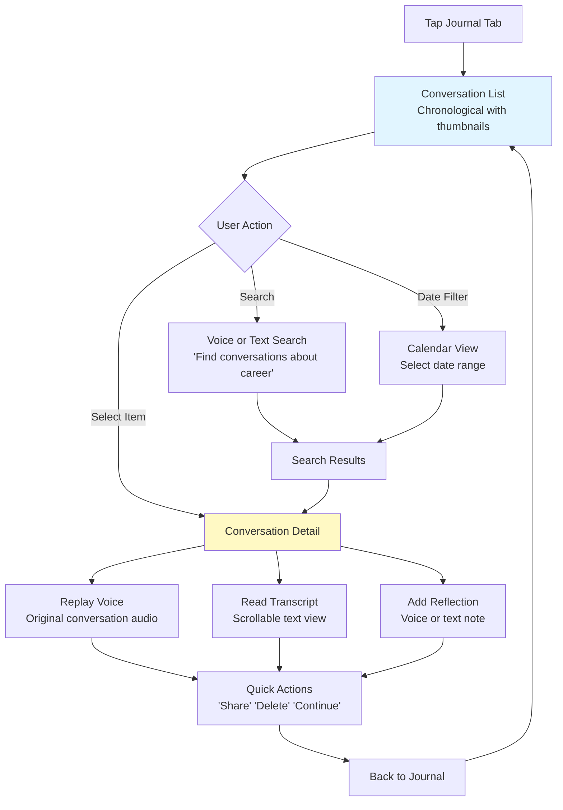

# Numeroly UI/UX Specification

**Document Version:** 1.0  
**Last Updated:** 2025-01-14  
**Author:** Sally (UX Expert)  
**Status:** Draft - Ready for Review

---

## Change Log

| Date | Version | Description | Author |
|------|---------|-------------|--------|
| 2025-01-14 | 1.0 | Initial UI/UX specification for Numeroly MVP | Sally (UX Expert) |

---

## Introduction

This document defines the user experience goals, information architecture, user flows, and visual design specifications for **Numeroly**'s user interface. Numeroly is a Vietnamese AI voicebot that provides Pythagorean numerology insights through natural voice conversations. 

This specification serves as the foundation for visual design and frontend development, ensuring a cohesive, voice-first, and user-centered experience that feels natural for Vietnamese users seeking numerological guidance.

### Overall UX Goals & Principles

#### Target User Personas

**1. The Spiritual Seeker (Primary - 60%)**
- **Demographics:** Vietnamese adults 25-45, urban areas, spiritually curious
- **Tech Comfort:** Moderate (comfortable with mobile apps, prefers voice over typing)
- **Numerology Knowledge:** Beginner to intermediate, seeking personal guidance
- **Goals:** Understand life path, make important decisions, find meaning
- **Pain Points:** Traditional numerology readings are expensive, impersonal, or inaccessible
- **Behavior:** Prefers conversational guidance over reading long texts, values authenticity

**2. The Daily Insight User (Secondary - 30%)**
- **Demographics:** Vietnamese millennials 20-35, tech-savvy, wellness-focused
- **Tech Comfort:** High (early adopters, use multiple wellness apps)
- **Numerology Knowledge:** Casual interest, explores various spiritual practices
- **Goals:** Daily guidance, quick insights, integrate numerology into routine
- **Pain Points:** Wants convenience without sacrificing quality
- **Behavior:** Uses voice while multitasking (commuting, morning routine)

**3. The Cultural Explorer (Tertiary - 10%)**
- **Demographics:** Vietnamese diaspora or cultural enthusiasts, 18-50
- **Tech Comfort:** High (comfortable with new technology)
- **Numerology Knowledge:** Curious, exploring Vietnamese spiritual traditions
- **Goals:** Learn about Vietnamese numerology culture, self-discovery
- **Pain Points:** Limited access to authentic Vietnamese spiritual guidance
- **Behavior:** Values cultural authenticity and Vietnamese language support

#### Usability Goals

1. **Immediate Voice Engagement:** Users can start speaking within 3 seconds of app launch
2. **Natural Conversation:** Voice interactions feel like talking to a knowledgeable friend, not a robot
3. **Visual Clarity:** When users glance at screen, they instantly understand conversation context
4. **Effortless Onboarding:** New users complete profile setup in under 2 minutes via voice
5. **Trust Building:** Design communicates credibility, privacy, and spiritual authenticity
6. **Accessibility:** Fully usable by voice alone (screen can be ignored if needed)
7. **Memorability:** Users remember how to access key features even after weeks away

#### Design Principles

1. **Voice First, Visual Second** - Design for voice interaction as primary, screen as supportive context
2. **Calm & Contemplative** - Create a peaceful environment that matches spiritual reflection
3. **Vietnamese Cultural Authenticity** - Honor Vietnamese spiritual aesthetics and communication norms
4. **Progressive Revelation** - Show complexity only when needed, start simple and welcoming
5. **Trustworthy Guidance** - Every design choice reinforces credibility and safety

---

## Information Architecture (IA)

### Site Map / Screen Inventory

### Navigation Structure

**Primary Navigation (Bottom Tab Bar):**
- **Home (Voice Hub):** Central hub for starting conversations - large, always accessible
- **Insights:** View numerology profile and saved insights
- **Journal:** Access conversation history and reflections
- **Profile:** Settings, account, and preferences

**Voice Navigation:**
- Users can say "Đưa tôi đến..." (Take me to...) to navigate by voice
- Voice commands work from any screen
- System confirms navigation with gentle audio feedback

**Gesture Navigation:**
- Swipe up from bottom: Quick access to voice input
- Pull down: Dismiss current conversation, return to home
- Long press on tabs: Quick access to subsections

**No Breadcrumbs:**
- Flat hierarchy - maximum 2 levels deep
- Clear screen titles and back buttons for context

---

## User Flows

### Flow 1: First-Time User Onboarding

**User Goal:** Create account and start first numerology conversation with minimal friction

**Entry Points:** 
- App first launch (organic)
- Push notification from waitlist (if applicable)

**Success Criteria:** 
- User completes voice profile setup within 2 minutes
- User experiences first voice interaction feeling natural and valuable
- User's birth data captured accurately for numerology calculations

#### Flow Diagram

**Edge Cases & Error Handling:**
- **Phone already registered:** "Welcome back! Log in with your number"
- **OTP timeout:** Auto-resend option with voice confirmation
- **Birth date validation:** Voice clarification for ambiguous dates
- **Voice permission denied:** Graceful fallback to text with later voice prompt
- **Network failure during setup:** Save progress, resume on reconnect
- **Unclear voice input:** "I didn't catch that, could you repeat?" with option to type

**Notes:** 
- Keep onboarding under 2 minutes to maintain momentum
- Voice should feel warm and conversational, not transactional
- Skip optional questions - only capture essentials (name, phone, birth date)

---

### Flow 2: Daily Voice Conversation

**User Goal:** Ask a numerology question and receive personalized voice guidance

**Entry Points:**
- Tap large "Speak" button on home screen
- Say "Hey Numeroly" (if wake word enabled)
- Quick action from notification

**Success Criteria:**
- Sub-3-second response time from speaking to hearing AI voice
- Conversation feels natural with appropriate emotional tone
- User receives actionable insight, not generic advice

#### Flow Diagram

**Edge Cases & Error Handling:**
- **Background noise:** "I'm having trouble hearing you. Can you find a quieter place?"
- **Unclear question:** "I want to help! Could you rephrase your question?"
- **Sensitive topic:** Gentle deflection to appropriate resources (not medical/legal advice)
- **API timeout:** "Taking a moment to think..." with retry logic
- **Lost internet:** "I need internet to answer. Your question is saved for when you're back online"
- **Multiple questions:** AI asks for clarification - which question to answer first

**Notes:**
- Visual feedback must match audio state (listening, thinking, speaking)
- Allow interruption - user can tap to stop AI mid-response
- Transcript scrolls automatically but user can scroll up to review

---

### Flow 3: Exploring Numerology Profile

**User Goal:** Understand saved numerology numbers and their meanings

**Entry Points:**
- Tap "Insights" tab
- Voice: "Show me my profile"
- Notification: "Your Personal Year just changed"

**Success Criteria:**
- User understands their core numbers (Life Path, Destiny, Soul, Personality)
- Each number explained clearly in Vietnamese context
- User can ask follow-up questions about any number

#### Flow Diagram

**Edge Cases & Error Handling:**
- **Incomplete profile:** Prompt to complete birth data with voice assistance
- **Profile calculation error:** Show cached data, retry in background
- **No internet for voice:** Text-only mode with "Tap to hear when online"

**Notes:**
- Each number card should feel special and meaningful, not data-heavy
- Use Vietnamese cultural metaphors when explaining numbers
- Allow both reading and listening for accessibility

---

### Flow 4: Reviewing Journal History

**User Goal:** Revisit past conversations and saved insights

**Entry Points:**
- Tap "Journal" tab
- Voice: "Show my past conversations"
- Search for specific topic

**Success Criteria:**
- Easy to find conversations by date or topic
- Can replay voice conversations or read transcripts
- Can add reflections or notes to past insights

#### Flow Diagram

**Edge Cases & Error Handling:**
- **Empty journal:** Warm prompt to start first conversation
- **Search no results:** Suggest related topics or browse by date
- **Deleted conversation:** Confirmation required, cannot undo
- **Long conversation:** Show summary first, expand to full transcript

---

## Wireframes & Mockups

**Primary Design Files:** To be created in Figma  
**Figma Project Link:** `[To be added]`

### Key Screen Layouts

#### 1. Home Screen (Voice Hub)

**Purpose:** Primary entry point for voice interactions, should feel inviting and calm

**Key Elements:**
- **Hero Voice Button** (60% of screen) - Large, pulsing gradient circle
  - Label: "Chạm để nói" (Tap to speak)
  - Subtle breathing animation when idle
  - Ripple animation on active listening
- **Greeting Text** - "Xin chào, [User Name]!" at top
  - Time-sensitive: Morning, Afternoon, Evening
  - Optional daily insight preview
- **Quick Insight Cards** - Horizontal scroll below voice button
  - Today's Personal Day number
  - Recent conversation snippet
  - Profile completion prompt (if incomplete)
- **Bottom Navigation** - 4 tabs with icons + labels
  - Home, Insights, Journal, Profile

**Interaction Notes:**
- Voice button is always reachable with thumb (bottom 2/3 of screen)
- Haptic feedback on button press
- Gentle scale animation on touch
- Wake word "Hey Numeroly" bypasses button if enabled

**Design File Reference:** `[Figma Frame: Home - Voice Hub]`

---

#### 2. Active Conversation Screen

**Purpose:** Provide clear visual feedback during voice conversation while maintaining focus on audio interaction

**Key Elements:**
- **Status Indicator** - Top of screen
  - "Đang nghe..." (Listening) - animated waveform
  - "Đang suy nghĩ..." (Thinking) - animated dots
  - "Đang trả lời..." (Speaking) - AI voice waveform
- **Live Transcript** - Middle section, auto-scrolling
  - User speech: Right-aligned, light blue bubbles
  - AI response: Left-aligned, white bubbles with gradient accent
  - Timestamps subtle, Vietnamese-formatted
- **Action Bar** - Bottom fixed
  - **Stop Button** - End conversation, save
  - **Mute** - Mute AI voice (transcript continues)
  - **Speed** - Adjust playback speed (1x, 1.25x, 1.5x)
- **Quick Actions** (appear contextually)
  - "Nói thêm" (Tell me more)
  - "Lưu lại" (Save this)
  - "Lặp lại" (Repeat)

**Interaction Notes:**
- Transcript auto-scrolls but user can scroll up (pause auto-scroll)
- Tap on any bubble to replay that segment
- Swipe down to minimize conversation (background mode)
- Pull down from top to exit with save prompt

**Design File Reference:** `[Figma Frame: Conversation - Active]`

---

#### 3. Numerology Profile Screen

**Purpose:** Display core numerology numbers in a beautiful, digestible format

**Key Elements:**
- **Profile Header** - User's full name + birth date
  - Visual representation of full numerology chart
  - Option to voice-explain full chart
- **Core Numbers Grid** - 2x2 card layout
  - **Life Path Number** - Largest, primary accent color
  - **Destiny Number** - Secondary size/color
  - **Soul Number** - Tertiary
  - **Personality Number** - Tertiary
  - Each card shows: Number, Title (Vietnamese), 1-line meaning
- **Current Cycles** - Collapsible section below grid
  - Personal Year, Personal Month, Personal Day
  - Timeline visualization showing current position in cycle
- **Voice Explanation Button** - Bottom fixed
  - "Nghe giải thích đầy đủ" (Listen to full explanation)

**Interaction Notes:**
- Tap any number card to see detailed view
- Swipe between number cards in detail view
- Long-press card to share as image
- Pull to refresh recalculates if birth data changed

**Design File Reference:** `[Figma Frame: Profile - Numbers Overview]`

---

#### 4. Onboarding Screens

**Purpose:** Welcome new users and collect essential information via voice-guided flow

**Key Elements:**

**Screen 1 - Welcome:**
- Animated logo with sound
- Tagline: "Khám phá bản thân qua thần số học" (Discover yourself through numerology)
- Auto-advances after 3 seconds with voice intro

**Screen 2 - Phone Auth:**
- Clean phone number input with Vietnam country code (+84) pre-selected
- Voice prompt: "Nhập số điện thoại của bạn" (Enter your phone number)
- Large, clear number pad (Vietnamese locale)

**Screen 3 - OTP:**
- 6-digit code input with auto-focus
- Voice reads code back for accessibility
- Resend timer: "Gửi lại mã sau {seconds} giây"

**Screen 4 - Name Collection:**
- Voice-first: "Tôi nên gọi bạn là gì?" (What should I call you?)
- Large waveform while listening
- Text fallback keyboard appears after 5 seconds or on tap

**Screen 5 - Birth Info:**
- Date picker (Vietnamese calendar format: DD/MM/YYYY)
- Voice input option: "Bạn sinh ngày nào?" (When were you born?)
- Time and location are optional (skip buttons)

**Screen 6 - Profile Generation:**
- Loading animation with numerology-themed visuals
- Progress text: "Đang tính toán số mệnh của bạn..." (Calculating your numbers...)
- 3-5 second duration

**Screen 7 - Profile Reveal:**
- Animated reveal of Life Path Number (largest)
- Voice explains significance
- CTA: "Bắt đầu trò chuyện" (Start conversation)

**Interaction Notes:**
- Skip option on every screen except phone auth and birth date
- Voice narration can be muted with speaker icon in top-right
- Progress dots at top show 7 steps
- Smooth transitions between screens (400ms)

**Design File Reference:** `[Figma Frame: Onboarding - Full Flow]`

---

## Component Library / Design System

**Design System Approach:** Create custom component library specifically for Numeroly, inspired by Vietnamese spiritual aesthetics and voice-first interaction patterns. Components should feel warm, trustworthy, and contemplative.

### Core Components

#### 1. Voice Button (Primary CTA)

**Purpose:** Main interaction point for voice input, needs to be inviting and obvious

**Variants:**
- **Large (Home Screen):** 200x200dp, center of screen
- **Medium (FAB):** 80x80dp, floating action button
- **Small (Inline):** 48x48dp, within cards or lists

**States:**
- **Idle:** Subtle pulse animation, gradient (purple to blue)
- **Listening:** Animated waveform border, solid accent color fill
- **Processing:** Rotating shimmer effect, slightly dimmed
- **Speaking:** Waveform animation synced to AI voice amplitude
- **Disabled:** Greyed out, 40% opacity, no animation
- **Error:** Red accent, shake animation once

**Usage Guidelines:**
- Always pair with clear label or icon
- Provide haptic feedback on press
- Ensure minimum touch target 48x48dp
- Never block with overlays during active state
- Voice button takes precedence over other interactions

---

#### 2. Conversation Bubble

**Purpose:** Display user and AI messages in transcript view

**Variants:**
- **User Message:** Right-aligned, blue-tinted background
- **AI Message:** Left-aligned, white background with subtle shadow
- **System Message:** Center-aligned, gray background, smaller text

**States:**
- **Default:** Static display with text
- **Playing:** Highlighted with subtle waveform animation
- **Saved:** Star icon in top-right corner
- **Loading:** Skeleton with shimmer animation

**Usage Guidelines:**
- Max width 80% of screen to maintain alignment clarity
- Include timestamp on hover/long-press only
- Allow tap to replay voice for that specific message
- Ensure sufficient color contrast for accessibility (WCAG AA)

---

#### 3. Number Card

**Purpose:** Display core numerology numbers with meaning and visual hierarchy

**Variants:**
- **Primary (Life Path):** Large format, detailed, gradient background
- **Secondary (Destiny, Soul, Personality):** Medium format, simpler
- **Cycle (Personal Year/Month/Day):** Compact, icon-focused

**States:**
- **Default:** Static display with number and title
- **Hover/Focus:** Subtle lift shadow, scale 1.05
- **Selected:** Thicker border, accent color glow
- **Loading:** Skeleton with shimmer

**Usage Guidelines:**
- Number should be the visual focus (64pt font minimum)
- Vietnamese title below number (16pt, medium weight)
- 1-line meaning in smaller text (14pt, regular weight)
- Gradient backgrounds match number's thematic color
- Tap opens detail view, long-press to share

---

#### 4. Waveform Visualizer

**Purpose:** Provide real-time visual feedback during voice interactions

**Variants:**
- **Listening (User):** Blue waveform, responds to user's voice amplitude
- **Speaking (AI):** Purple-gradient waveform, responds to AI voice output
- **Idle:** Subtle ambient wave, slow breathing pattern

**States:**
- **Active:** Real-time audio reactive, 30-60 FPS
- **Paused:** Frozen at current state
- **Muted:** Greyed out, no animation

**Usage Guidelines:**
- Place prominently when voice is active (center or top)
- Smooth animation is critical (avoid jank)
- Provide visual feedback even if audio is muted
- Consider device performance (reduce complexity on low-end devices)

---

#### 5. Action Chip

**Purpose:** Quick contextual actions during or after conversations

**Variants:**
- **Primary:** Solid background, accent color (e.g., "Lưu lại")
- **Secondary:** Outlined, no fill (e.g., "Bỏ qua")
- **Voice Action:** Icon + label, optimized for voice command

**States:**
- **Default:** Static display
- **Hover/Focus:** Slight scale, darker border
- **Pressed:** Scale down 0.95, darker fill
- **Disabled:** Greyed out, 40% opacity

**Usage Guidelines:**
- Maximum 3-4 chips visible at once
- Horizontal scroll if more actions needed
- Label should be concise (1-3 words Vietnamese)
- Always provide both tap and voice command equivalents
- Auto-hide after 10 seconds of inactivity (can be re-triggered)

---

## Branding & Style Guide

**Brand Guidelines:** Create comprehensive brand guide incorporating Vietnamese spiritual aesthetics with modern, trustworthy design

### Visual Identity

**Brand Essence:** Numeroly combines ancient Vietnamese numerology wisdom with cutting-edge AI technology. The visual identity should feel:
- **Spiritual yet Accessible:** Honor tradition without feeling mystical or exclusive
- **Modern yet Timeless:** Contemporary design that respects cultural heritage
- **Trustworthy yet Warm:** Professional enough to trust, human enough to connect with
- **Calm yet Engaging:** Peaceful environment that invites exploration

### Color Palette

| Color Type | Hex Code | RGB | Usage |
|------------|----------|-----|-------|
| **Primary** | `#6B4CE6` | rgb(107, 76, 230) | Voice button, primary CTAs, key numbers, links |
| **Primary Dark** | `#5237BA` | rgb(82, 55, 186) | Pressed states, shadows, depth |
| **Primary Light** | `#9B82FF` | rgb(155, 130, 255) | Highlights, subtle accents, hover states |
| **Secondary** | `#4ECDC4` | rgb(78, 205, 196) | Secondary actions, success states, wellness indicators |
| **Accent (Gold)** | `#F7B731` | rgb(247, 183, 49) | Premium features, highlights, special numbers |
| **Success** | `#05C46B` | rgb(5, 196, 107) | Confirmations, positive feedback, completed actions |
| **Warning** | `#FFA502` | rgb(255, 165, 2) | Cautions, important notices, incomplete profiles |
| **Error** | `#FF3838` | rgb(255, 56, 56) | Errors, destructive actions, voice input failures |
| **Neutral 900** | `#1A1A2E` | rgb(26, 26, 46) | Primary text, headings |
| **Neutral 700** | `#4A4A68` | rgb(74, 74, 104) | Secondary text, labels |
| **Neutral 500** | `#8E8EA9` | rgb(142, 142, 169) | Tertiary text, placeholders |
| **Neutral 300** | `#C8C8D8` | rgb(200, 200, 216) | Borders, dividers, disabled text |
| **Neutral 100** | `#F0F0F5` | rgb(240, 240, 245) | Subtle backgrounds, cards |
| **Neutral 50** | `#FAFAFA` | rgb(250, 250, 250) | App background, light surfaces |

**Color Usage Philosophy:**
- **Primary Purple:** Represents spirituality, intuition, and wisdom in Vietnamese culture
- **Secondary Teal:** Represents balance, healing, and flow
- **Accent Gold:** Represents prosperity and divine connection
- Use gradients for key interactive elements (voice button, number reveals)
- Maintain 4.5:1 contrast ratio minimum for all text (WCAG AA)

### Typography

#### Font Families

- **Primary (Vietnamese):** **Inter** (for Vietnamese diacritics support)
  - Weights: 400 (Regular), 500 (Medium), 600 (SemiBold), 700 (Bold)
  - Excellent readability, modern, supports Vietnamese characters perfectly
- **Display (Numbers):** **Poppins** 
  - Weights: 600 (SemiBold), 700 (Bold)
  - Used for large numerology numbers, clear and distinctive
- **Monospace (Data):** **JetBrains Mono**
  - Weight: 400 (Regular)
  - Used for technical info, timestamps, IDs

#### Type Scale

| Element | Size | Weight | Line Height | Usage |
|---------|------|--------|-------------|-------|
| **H1** | 32pt | Bold (700) | 40pt (1.25) | Screen titles, major section headers |
| **H2** | 24pt | SemiBold (600) | 32pt (1.33) | Card titles, sub-sections |
| **H3** | 20pt | SemiBold (600) | 28pt (1.4) | List headers, grouped content |
| **H4** | 18pt | Medium (500) | 24pt (1.33) | Minor headers, emphasized content |
| **Body Large** | 16pt | Regular (400) | 24pt (1.5) | Primary body text, conversation transcripts |
| **Body** | 14pt | Regular (400) | 20pt (1.43) | Secondary body text, descriptions |
| **Body Small** | 12pt | Regular (400) | 18pt (1.5) | Captions, tertiary info, timestamps |
| **Label** | 14pt | Medium (500) | 20pt (1.43) | Button labels, form labels |
| **Number Display** | 64pt | Bold (700) | 64pt (1.0) | Core numerology numbers on cards |
| **Number Large** | 96pt | Bold (700) | 96pt (1.0) | Hero number on detail screens |

**Typography Guidelines:**
- Always use Inter for Vietnamese text to ensure diacritics render correctly
- Use sentence case for UI labels (not title case) to feel conversational
- Maintain minimum 14pt for body text on mobile (accessibility)
- Increase line height for dense content (1.5-1.6 for long paragraphs)

### Iconography

**Icon Library:** Custom icon set + Feather Icons (supplementary)

**Custom Icons Needed:**
- Voice wave (multiple states: idle, listening, speaking)
- Numerology numbers (stylized 1-9 with spiritual accents)
- Lotus flower (Vietnamese spiritual symbol)
- Calendar/cycles (for Personal Year/Month/Day)
- Journal/reflection
- Profile/identity

**Usage Guidelines:**
- Icon size: 24x24dp (standard), 32x32dp (emphasis), 16x16dp (inline)
- Stroke width: 2px for consistency
- Use accent color for active/selected states
- Pair icons with labels for clarity (especially for older users)
- Ensure icons are culturally appropriate for Vietnamese audience

### Spacing & Layout

**Grid System:** 8pt grid system for consistency and scalability

**Spacing Scale:**
- **4pt:** Tight spacing (icon + label, related elements)
- **8pt:** Standard spacing (within components)
- **16pt:** Comfortable spacing (between components, section padding)
- **24pt:** Generous spacing (between sections, screen padding)
- **32pt:** Spacious (major section dividers)
- **48pt:** Hero spacing (around key elements like voice button)

**Layout Principles:**
- **Screen Padding:** 16pt on sides, 24pt top/bottom (mobile)
- **Card Padding:** 16pt internal padding
- **Minimum Touch Target:** 48x48dp for all interactive elements
- **Maximum Content Width:** 600dp (for tablets/larger screens)
- **Safe Area:** Respect iOS notch and Android nav bars (use SafeAreaView)

---

## Accessibility Requirements

### Compliance Target

**Standard:** WCAG 2.1 Level AA compliance with additional considerations for voice-first interactions

**Priority:** High - Voice-first design inherently supports visually impaired users, must maintain this advantage

### Key Requirements

**Visual:**
- **Color Contrast Ratios:** Minimum 4.5:1 for text, 3:1 for UI components and graphical objects
  - Test all text colors against backgrounds with contrast checker
  - Primary purple `#6B4CE6` on white background: 5.2:1 ✅
  - Body text `#1A1A2E` on white: 14.8:1 ✅
- **Focus Indicators:** 2px solid accent color outline on all interactive elements
  - Visible on keyboard navigation
  - Never remove focus outline (only enhance)
- **Text Sizing:** Minimum 14pt for body text, support dynamic type (iOS) / font scaling (Android)
  - Test at 200% zoom - layout should not break
  - All text should be resizable without loss of functionality

**Interaction:**
- **Keyboard Navigation:** All functionality accessible via external keyboard
  - Tab order follows logical reading flow
  - Enter/Space activates buttons and controls
  - Escape dismisses modals and conversations
- **Screen Reader Support:** Full VoiceOver (iOS) and TalkBack (Android) compatibility
  - All interactive elements have descriptive labels in Vietnamese
  - Images have alt text (or marked decorative)
  - Voice button announces state: "Nút ghi âm, nhấn để bắt đầu nói" (Record button, tap to speak)
  - Transcripts announced as they appear (live region)
- **Touch Targets:** Minimum 48x48dp for all tappable elements
  - Increase to 56x56dp for primary actions
  - Adequate spacing between adjacent targets (8pt minimum)

**Content:**
- **Alternative Text:** All meaningful images include descriptive Vietnamese alt text
  - Numerology card images: "Số mệnh 5 - Tự do và Thay đổi"
  - Icons always paired with text labels (or aria-label)
- **Heading Structure:** Logical hierarchy (H1 → H2 → H3, no skipping)
  - Screen title always H1
  - Major sections H2, subsections H3
- **Form Labels:** Every input has visible label or placeholder with aria-label
  - Phone number input: "Số điện thoại" label above field
  - Error messages associated with fields via aria-describedby

**Voice-Specific Accessibility:**
- **Audio Captions:** All AI voice responses shown as live text transcript
  - Synchronized highlighting as voice plays
  - Option to read-only mode (disable auto-play voice)
- **Voice Alternatives:** Every voice command has visual/touch equivalent
  - Can complete entire app flow without voice if needed
- **Transcription Accuracy:** Display confidence scores for ambiguous voice input
  - Allow user to correct misheard text before submitting

### Testing Strategy

**Automated Testing:**
- Integrate axe-core accessibility testing in development build
- Run automated tests on every PR (check color contrast, aria labels, heading structure)
- Use ESLint plugin for React accessibility rules

**Manual Testing:**
- Weekly testing with VoiceOver (iOS) and TalkBack (Android) enabled
- Test with keyboard-only navigation (Bluetooth keyboard + mobile)
- Test at 200% font size and verify layout
- Test in grayscale mode to verify color is not sole indicator

**User Testing:**
- Include users with visual impairments in beta testing
- Test with older users (60+) to verify readability and voice clarity
- Conduct testing in noisy environments (coffee shops, streets) for voice reliability

---

## Responsiveness Strategy

### Breakpoints

| Breakpoint | Min Width | Max Width | Target Devices | Notes |
|------------|-----------|-----------|----------------|-------|
| **Mobile Small** | 320px | 374px | iPhone SE, older Android | Minimum viable layout, single column |
| **Mobile** | 375px | 767px | iPhone 12-15, most Android phones | Primary target, optimized voice-first UI |
| **Tablet** | 768px | 1023px | iPad, Android tablets | Two-column layouts where appropriate |
| **Desktop** | 1024px+ | - | iPad Pro landscape, desktop web (future) | Max-width container, centered content |

**Note:** Primary focus is **Mobile (375px-767px)** as this is a mobile-first app. Tablet and desktop support for future web PWA version.

### Adaptation Patterns

**Layout Changes:**
- **Mobile (< 768px):**
  - Single column layout throughout
  - Full-width cards with 16pt side padding
  - Bottom tab navigation
  - Voice button centered, 200x200dp
- **Tablet (768px-1023px):**
  - Two-column grid for number cards (2x2 becomes 1x4 side-by-side)
  - Conversation transcript in sidebar (40% width) with voice button in main area (60%)
  - Floating voice button (FAB) always accessible
- **Desktop (1024px+):**
  - Max content width 1200px, centered
  - Three-column layout for journal history
  - Conversation in main area with profile sidebar

**Navigation Changes:**
- **Mobile:** Bottom tab bar (always visible, 4 tabs)
- **Tablet:** Side navigation drawer (collapsible, 5 items + settings)
- **Desktop:** Persistent left sidebar (always visible)

**Content Priority:**
- **Mobile:** Voice-first, hide secondary info in expandable sections
- **Tablet:** Show more context upfront (e.g., recent insights on home screen)
- **Desktop:** Show full context, multi-panel views

**Interaction Changes:**
- **Mobile:** Swipe gestures for navigation (swipe right = back)
- **Tablet:** Support for drag-and-drop (reorder saved insights)
- **Desktop:** Hover states, keyboard shortcuts (Cmd+K = start voice)

---

## Animation & Micro-interactions

### Motion Principles

1. **Purposeful Motion:** Every animation serves a functional purpose (feedback, guidance, or delight)
2. **Natural Timing:** Animations feel physically natural, using easing curves (not linear)
3. **Respect Reduced Motion:** Honor system preference for reduced motion (iOS/Android)
4. **Performance First:** Target 60 FPS, reduce complexity on low-end devices
5. **Spiritual Fluidity:** Movements should feel flowing and peaceful, not jarring or abrupt

**Timing:**
- **Fast (100-200ms):** Micro-interactions, feedback (button press, toggle)
- **Medium (300-400ms):** Transitions, reveals (screen changes, card flips)
- **Slow (500-800ms):** Hero animations, celebrations (number reveals, achievements)

**Easing:**
- **Standard:** Cubic-bezier(0.4, 0.0, 0.2, 1) - Most transitions
- **Deceleration:** Cubic-bezier(0.0, 0.0, 0.2, 1) - Elements entering screen
- **Acceleration:** Cubic-bezier(0.4, 0.0, 1, 1) - Elements leaving screen
- **Spring:** Bounce effect for playful moments (use sparingly)

### Key Animations

**1. Voice Button Pulse (Idle State)**
- **Description:** Subtle scale and opacity pulse to draw attention without being distracting
- **Duration:** 2000ms loop
- **Easing:** Ease-in-out
- **Implementation:** Scale from 1.0 to 1.08, opacity 0.9 to 1.0

**2. Listening Waveform**
- **Description:** Real-time audio visualization responding to user's voice amplitude
- **Duration:** Continuous while listening
- **Easing:** Linear (real-time)
- **Implementation:** Canvas-based, 30-60 bars animating vertically based on frequency data

**3. Speaking Waveform (AI)**
- **Description:** Purple-gradient waveform synced to AI voice output
- **Duration:** Continuous during AI speech
- **Easing:** Linear (real-time)
- **Implementation:** Similar to listening waveform but synced to playback audio

**4. Screen Transition**
- **Description:** Smooth fade and slide when navigating between screens
- **Duration:** 300ms
- **Easing:** Cubic-bezier(0.4, 0.0, 0.2, 1)
- **Implementation:** Slide in from right (forward nav), slide in from left (back nav)

**5. Number Card Reveal**
- **Description:** Animated reveal of numerology number after calculation (first time)
- **Duration:** 800ms
- **Easing:** Cubic-bezier(0.0, 0.0, 0.2, 1) (deceleration)
- **Implementation:** Number scales from 0 to 1 with slight overshoot (1.05) then settles, fade in background gradient

**6. Conversation Bubble Appear**
- **Description:** New message bubbles slide in with fade
- **Duration:** 200ms
- **Easing:** Cubic-bezier(0.4, 0.0, 0.2, 1)
- **Implementation:** Translate Y from 20px to 0px, opacity 0 to 1

**7. Haptic Feedback (Micro-interactions)**
- **Description:** Tactile feedback on key interactions
- **Duration:** 50ms (device-dependent)
- **Easing:** N/A (haptic)
- **Implementation:**
  - Light impact: Tap voice button, toggle switches
  - Medium impact: Message sent, insight saved
  - Heavy impact: Error, profile calculation complete

**8. Loading Skeleton (Content Loading)**
- **Description:** Shimmer effect across placeholder content
- **Duration:** 1500ms loop
- **Easing:** Linear
- **Implementation:** Gradient mask moving left-to-right across grey skeleton shapes

**9. Success Celebration (Save/Complete Action)**
- **Description:** Brief scale bounce with checkmark icon
- **Duration:** 400ms
- **Easing:** Spring (bounce)
- **Implementation:** Icon scales from 0 to 1.2 to 1.0, with rotation from -10° to 0°

**10. Error Shake (Validation Failure)**
- **Description:** Horizontal shake to indicate error
- **Duration:** 400ms
- **Easing:** Cubic-bezier(0.4, 0.0, 0.2, 1)
- **Implementation:** Translate X: 0 → -10px → 10px → -5px → 5px → 0, with red accent color flash

---

## Performance Considerations

### Performance Goals

- **Initial Load Time:** < 2 seconds to interactive home screen (on 4G connection)
- **Voice Button Response:** < 100ms from tap to visual feedback (listening state)
- **Voice-to-Text Latency:** < 1 second from stop speaking to transcription appearing
- **AI Response Time:** < 3 seconds from user question end to AI voice starting (as per architecture requirement)
- **Screen Transition:** < 300ms animation duration, maintain 60 FPS
- **Animation Frame Rate:** 60 FPS for all animations (degrade gracefully on low-end devices)
- **Memory Usage:** < 150MB RAM baseline, < 250MB during active voice conversation
- **Bundle Size:** < 30MB APK/IPA (initial download), < 50MB with assets

### Design Strategies for Performance

**1. Asset Optimization:**
- Use SVG for icons and simple graphics (smaller + scalable)
- Compress PNG/JPG images with TinyPNG (target < 100KB per image)
- Use WebP format where supported (better compression than PNG/JPG)
- Implement lazy loading for off-screen images (conversation history, journal)
- Use image placeholders with blur-up effect while loading

**2. Animation Performance:**
- Use GPU-accelerated properties only (transform, opacity)
- Avoid animating expensive properties (width, height, top, left)
- Reduce complexity on low-end devices (detect via device capabilities)
- Honor `prefers-reduced-motion` system setting (disable decorative animations)
- Use `will-change` CSS property sparingly (only during animation)

**3. Voice Interaction Optimization:**
- Pre-load audio processing libraries during app initialization
- Use Web Audio API for low-latency audio visualization
- Implement audio buffer pooling to reduce memory allocation overhead
- Show instant visual feedback (< 100ms) before actual voice processing starts
- Cache commonly used voice responses (e.g., "Hello", "I didn't catch that")

**4. Rendering Optimization:**
- Virtualize long lists (conversation history) - render only visible items
- Use React.memo / useMemo to prevent unnecessary re-renders
- Debounce scroll events (wait 150ms before processing)
- Implement code splitting - load screens on demand (React.lazy)
- Use skeleton loading screens instead of spinners (perceived performance)

**5. Network Optimization:**
- Prefetch next likely screens during idle time
- Implement aggressive caching for numerology profile data (long-lived)
- Use compression for API responses (gzip/brotli)
- Implement retry logic with exponential backoff for failed requests
- Show cached data immediately, update in background (stale-while-revalidate)

**6. Design Simplification:**
- Reduce visual complexity on older devices (detected via device year/model)
- Use static gradients instead of animated ones on low-end devices
- Limit number of simultaneous animations (max 3 at once)
- Simplify waveform visualization on devices with < 2GB RAM (fewer bars)

**7. Testing & Monitoring:**
- Test on low-end Android device (e.g., Samsung Galaxy A series, 2-3 years old)
- Monitor performance with React Native Performance Monitor
- Set up error tracking for animation jank / dropped frames
- Establish performance budgets: 300ms budget for screen transitions

---

## Next Steps

### Immediate Actions

1. **Stakeholder Review** - Present this UI/UX specification to project stakeholders for feedback
   - Key decision makers: Product Owner, Tech Lead, Voice UX specialist (if available)
   - Focus areas for review: Voice-first approach, Vietnamese cultural appropriateness, MVP scope
   - Timeline: 1 week for review and feedback

2. **Create Visual Designs in Figma** - Translate wireframes into high-fidelity mockups
   - Set up Figma design system with colors, typography, and components
   - Design all key screens in mobile-first format (375px width)
   - Create interactive prototype for user testing
   - Timeline: 2 weeks (overlaps with step 1)

3. **Validate with User Research** - Test designs with 5-10 target users (Vietnamese, spiritually curious)
   - Test onboarding flow (can they complete setup in under 2 minutes?)
   - Test voice interaction (does conversation feel natural?)
   - Test information architecture (can they find their numerology profile?)
   - Timeline: 1 week after designs are ready

4. **Prepare for Frontend Architecture** - Collaborate with Design Architect to translate UI/UX into technical specs
   - Define React Native component structure
   - Specify state management approach (Zustand as per architecture)
   - Map animations to React Native Animated API or Reanimated
   - Timeline: 1 week, after user testing feedback incorporated

5. **Update PRD if Needed** - Based on UX discoveries, update PRD with clarifications or scope changes
   - Document any new features identified during design process
   - Clarify any ambiguous requirements discovered
   - Timeline: Ongoing, as needed

### Design Handoff Checklist

- [ ] All user flows documented (Onboarding, Voice Conversation, Profile Viewing, Journal)
- [ ] Component inventory complete (Voice Button, Conversation Bubble, Number Card, etc.)
- [ ] Accessibility requirements defined (WCAG 2.1 AA, screen reader support, voice alternatives)
- [ ] Responsive strategy clear (Mobile-first, tablet, desktop breakpoints defined)
- [ ] Brand guidelines incorporated (Color palette, typography, iconography, spacing)
- [ ] Performance goals established (< 3s AI response, 60 FPS animations, < 2s load time)
- [ ] Figma design files created and linked
- [ ] Interactive prototype ready for user testing
- [ ] User testing completed with at least 5 Vietnamese users
- [ ] Feedback from user testing incorporated into designs
- [ ] Frontend architecture collaboration initiated
- [ ] All open questions and decisions documented

---

**End of Document**

_This UI/UX Specification provides the foundation for Numeroly's frontend development. The voice-first, culturally authentic approach ensures Vietnamese users will have a natural, meaningful experience exploring numerology through conversation._

_Next step: Create high-fidelity mockups in Figma and validate with user research._

---

**Document Version:** 1.0  
**Last Updated:** 2025-01-14  
**Author:** Sally (UX Expert)  
**Status:** Draft - Ready for Review
