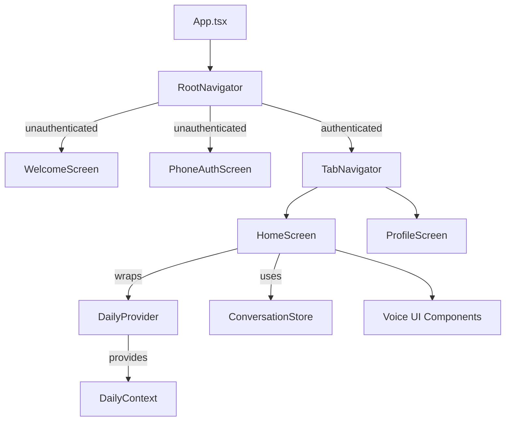
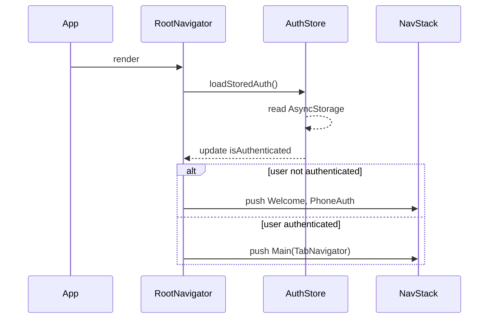
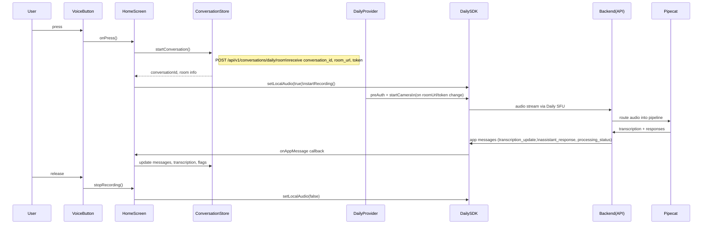
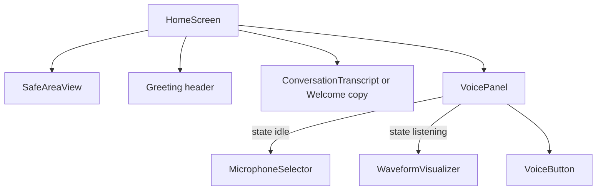

# Frontend Architecture & Voice Flow Review (React Native / Expo)

## 1. High-Level App Structure



- `App.tsx` is the Expo entry point; it renders `RootNavigator`.
- `RootNavigator` (React Navigation native stack) chooses onboarding screens or the tab app based on `useAuthStore().isAuthenticated`.
- `TabNavigator` defines the bottom tabs; the Home tab is wrapped by `DailyProvider`, which primes Daily.co device access.
- Zustand stores (`authStore.ts`, `conversationStore.ts`) hold global state for auth and conversations.

## 2. Navigation & State Bootstrapping



Key files:
- `apps/mobile/src/navigation/RootNavigator.tsx`
- `apps/mobile/src/store/authStore.ts`
- `apps/mobile/src/navigation/TabNavigator.tsx`


## 3. Home Screen Voice Flow



Relevant files:
- `HomeScreen.tsx`
- `services/voiceInputService.ts` / `voiceOutputService.ts`
- `components/voice/VoiceButton.tsx`, `MicrophoneSelector.tsx`, `WaveformVisualizer.tsx`
- `components/conversation/ConversationTranscript.tsx`
- `store/conversationStore.ts`

## 4. Conversation Store Responsibilities

```mermaid
flowchart LR
    start[startConversation] --> POST_API[POST /api/v1/conversations/daily/room]
    POST_API -->|success| setState{Update store}
    setState --> dailyRoomUrl
    setState --> dailyToken
    setState --> activeConversationId
    setState --> messages[]
    setState --> flags[isRecording, isProcessing, isAiTyping]

    endConversation --> PATCH_API[PATCH /api/v1/conversations/{id}]
    PATCH_API --> resetState[clear store + Daily creds]
    addMessage --> append(messages)
    setRecording --> updateFlag
    setProcessing --> updateFlag
    setTranscription --> updateText
```

- API root comes from `EXPO_PUBLIC_API_URL` (default `http://localhost:8000`).
- Messages list drives `ConversationTranscript`.
- Daily credentials trigger `DailyProvider`’s device initialization.

## 5. Component Composition on Home Screen



- Greeting uses `VIETNAMESE_GREETINGS` from `utils/constants`.
- `WaveformVisualizer` now renders the real mic level streamed from Daily (`input-level` events in `useVoiceInputService`).
- `VoiceButton` drives the `VoiceButtonState` state machine (`idle` → `listening` → `processing` / `error`).

## 6. Platform Considerations & Warnings

- Web builds log warnings when Daily’s web SDK ignores `audio.processor` settings; Native platforms honor it.
- Expo Haptics maps to `navigator.vibrate()` on web; Chrome warns when vibration is unsupported.
- Both cases degrade gracefully; add platform guards if you want a clean console.

## 7. Suggested Next Steps for Familiarity
1. Run `./start-mobile.sh` and attach Expo Go (iOS/Android) to experience the navigation + voice flow end-to-end.
2. Review `services/voiceInputService.ts` & `voiceOutputService.ts` to understand Daily hook usage.
3. Inspect `conversationStore.ts` network calls; they’re the main link to the backend pipeline.
4. Explore `providers/DailyProvider.tsx` to see how device pre-auth and camera bootstrapping works.
5. Use React DevTools or Expo’s inspector to trace component re-renders while interacting with voice UI.

Feel free to extend with screen-specific deep dives or additional diagrams (e.g., onboarding flow) as you continue the review.
